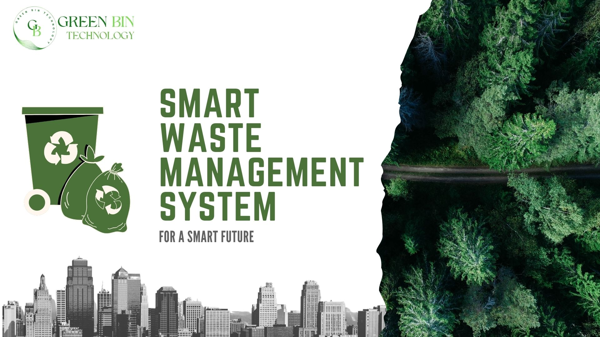
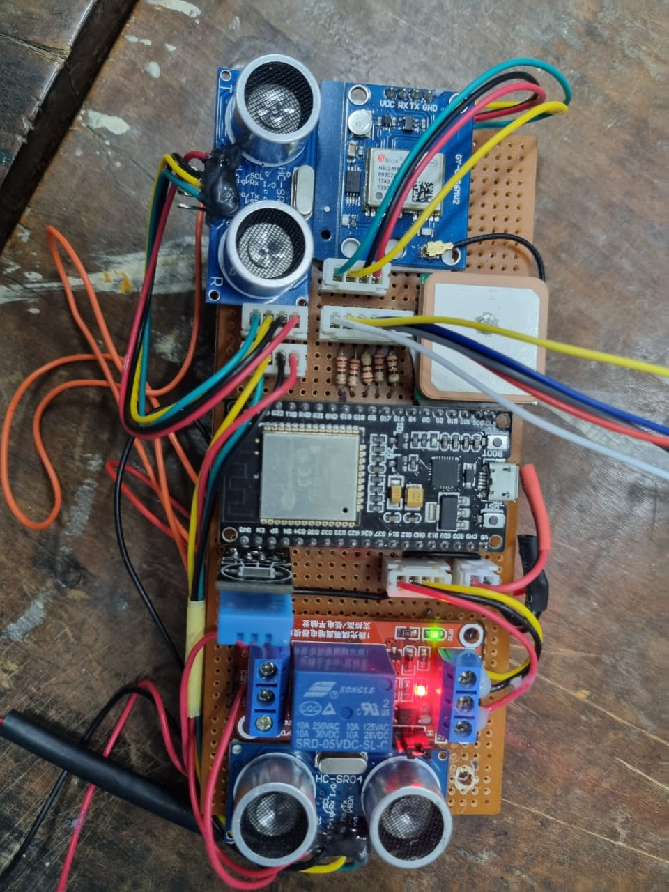
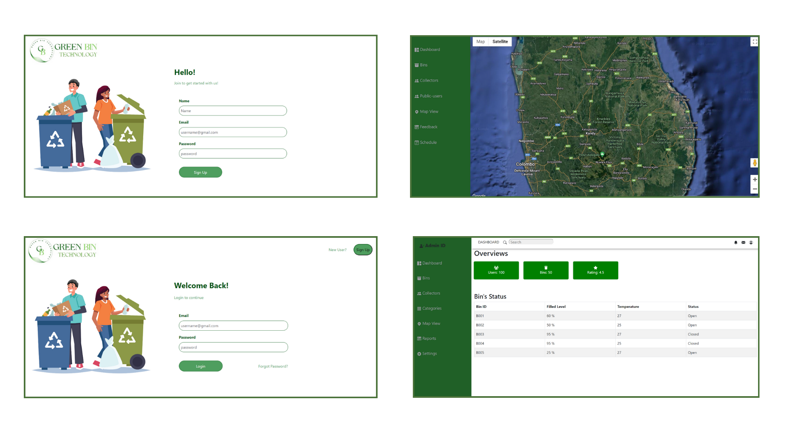

# SMART WASTE MANAGEMENT SYSTEM 

## Project Overview

Our project is a smart waste management system that aims to make the process of waste collection more efficient. The system utilizes waste bins and manages them through mobile and web applications. With the help of the system, users can easily check the status of the bins and follow a schedule for waste collection based on the bin's status. Our primary focus is on house owners, garbage collectors, and municipal authorities who serve as administrators in the system. The system is designed to make waste management easier and more effective for everyone involved.

## Project Components

- Hardware setup: Bins with level measuring sensors and temperature sensors, with proper power supply system connected to LEDs.
  

  
  

- Software setup: Mobile application for house owners and garbage collectors; Web application for municipal authorities.
  

  
  

- AWS Server: Hosting the website, data storing and database hosting.
  

  
  

## Key Features

- User-friendly web-based interface for administrators and mobile application for house owners and garbage collectors.
- Auto-locking system while the wastage filled a certain level.
- Direct bin lock access to garbage collectors and administrators.
- Smart waste bins with fill level sensors and temperature monitoring.
- Real-time data transmission to a central server.
- Web and mobile applications for user interaction.
- Route optimization for waste collection.
- LED indicators on bins for visual fill level representation.
- GPS tracking for bin location information.

## Technological Stack

- **Frontend:**
  - React.js for the web application.
  - React Native for the mobile application.

- **Backend:**
  - Node.js with Express for server development.
  - MongoDB for the database.

- **IoT Devices:**
  - Arduino/Raspberry Pi for smart waste bins.
  - MQTT for communication.

- **Authentication:**
  - JWT (JSON Web Tokens) for secure authentication.

- **Communication:**
  - MQTT for IoT device communication.
  - WebSocket for real-time updates in the frontend.

- **Security Measures:**
  - Passwords hashed using bcrypt.
  - reCAPTCHA for enhanced security.
  - HTTPS for secure data transmission.

- **Cloud and Scalability:**
  - AWS for cloud infrastructure.
  - Docker and Kubernetes for containerization and orchestration.

## Future Enhancements
We are eagerly planning to make it more automated using Machine Learning features, where the wastage collection is optimized according to the previous data series. 

## Project page

[GBTech - Project Page - Group 13](https://cepdnaclk.github.io/e19-3yp-Smart-Waste-Management-System/#)

## Project presentations

- [Sweet Spot of Strategy](https://drive.google.com/file/d/1_iim-TmS1jCIfwZ9MfVkiFRLbPNmxw5q/view?usp=drive_link)

- [2nd Evaluvation Presentation](https://drive.google.com/file/d/1Vvn-2brWBArEeAGV8kTvu1PFv8DZbGrH/view?usp=drive_link)

- [3rd Evaluvation Presentation](https://drive.google.com/file/d/1_iim-TmS1jCIfwZ9MfVkiFRLbPNmxw5q/view?usp=drive_link)

## Our Team - Group 13

- E/19/105: [M. H. M. Fahman](https://people.ce.pdn.ac.lk/students/e19/105/)
- E/19/106: [M. F. M. Faseeh](https://people.ce.pdn.ac.lk/students/e19/106/)
- E/19/205: [Kumara I. P. S. N. U.](https://people.ce.pdn.ac.lk/students/e19/205/)
- E/19/244: [Mohanathas H.](https://people.ce.pdn.ac.lk/students/e19/244/)
- E/19/249: [M.P.S.A. Muthukumarana](https://people.ce.pdn.ac.lk/students/e19/249/)
